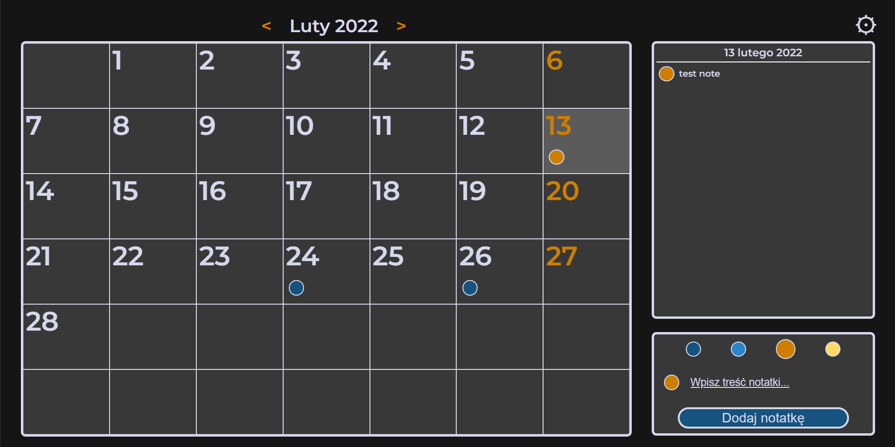

# PersonalCalendar

Simple personal calendar web app created without use of any frameworks.

---------

This application is adapted for mobile screens.  
It gives ability to add / remove and present locally stored notes.

The user has the option to export all notes to \*.ics file in order to use them in any other application \ service.

---------
This project was created by:
* [Justyna Walotek](https://www.linkedin.com/in/justyna-walotek-889169210/) - UI Designer
* Łukasz Piątkowski [@LukaszPiatkowski27](https://github.com/LukaszPiatkowski27) - Main developer

and it was implemented for the purposes of computer science studies at the Silesian University of Technology 2022
